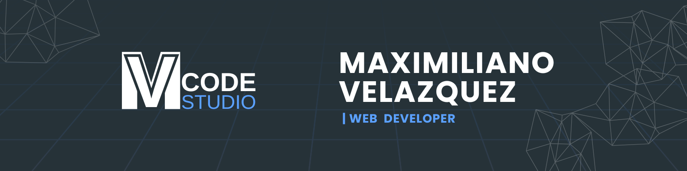

 

  

 
	
## <picture></picture> About me

 

## 🛠️ My Skills

- **Languages**:

 
  

- **Frameworks**:

 
 

- **Databases & Cloud Hosting**: 

	
 

 - **Software & Tools**: 

    

 

<h3 align="center">Connect with me:</h3>

  

